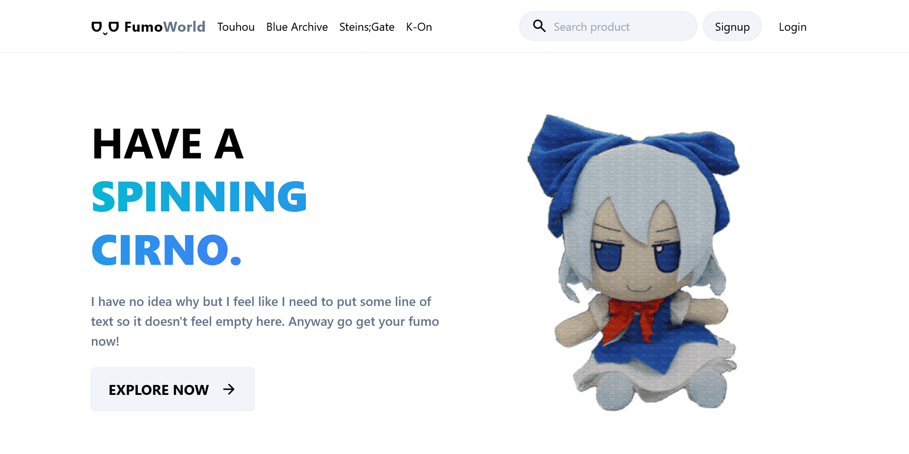

# FumoWorld - An E-commerce website that selling fumos.

## Project Overview

FumoWorld is an e-commerce platform specifically designed to sell Fumos—plush collectibles based on popular anime and game characters. This website provides a user-friendly experience for customers to browse, search, and purchase Fumo products. The project aims to deliver a clean, modern interface with a responsive design that works well across devices.

## Screenshot



## Features

- **Product Listings:** Display detailed information on each Fumo, including images, pricing, description, and stock availability.
- **Product Search:** Users can easily search for specific Fumos by name.
- **Shopping Cart:** Allows users to add items to their cart, review their selection, and proceed to checkout.
- **User Authentication:** Customers can create accounts, log in, and manage their profiles, order history, and saved items.
- **Responsive Design:** The website is optimized for mobile, tablet, and desktop devices.
- **Admin Dashboard:** Admins can manage product listings, track orders, and view user data.

## Installation & Setup

1. **Clone the repository**

```bash
git clone https://github.com/69kwan69/fumoworld.git
```

2. **Install dependencies and build** Navigate to the project folder and install the necessary dependencies:

```bash
cd fumoworld/server
npm run build
```

3. **Set Up Environment Variables** Create a .env file in the `/server` directory and set the following variables:

```makefile
DB_SERVER=<your-mongo-server>
DB_USER=<your-mongo-user>
DB_PASS=<your-mongo-pass>
DB_DATABASE=<your-mongo-database>
JWT_SECRET=<your-jwt-secret>
JWT_EXPIRES=<your-jwt-expires>
EMAIL_USER=<your-email>
EMAIL_PASS=<your-email-pass>
```

4. **Run the application** Navigate to `\server` directory and run the application:

```bash
npm start
```

Open the browser and go to http://localhost:3000.
